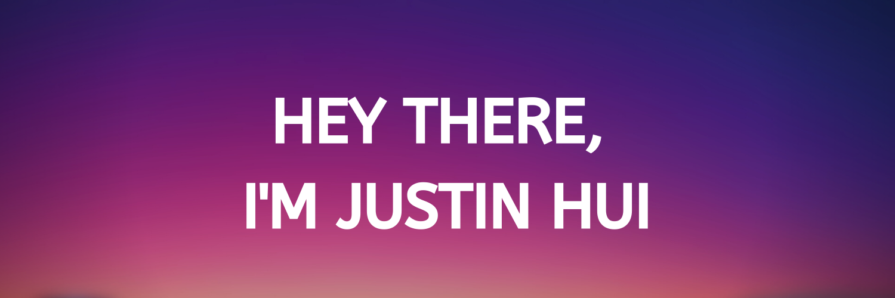

## I'm a recent graduate of a Full Stack Bootcamp through Trilogy Education.

- ⌚ I’m currently working on unfinished freeCodeCamp material and projects.
- 💻 I’m currently learning Python and more about React and Bulma.
- 🥅 2021 Goals: Getting my foot in the door as a junior Frontend developer.
- 🏆 Life Goal (Coding): Mastering the reduce array method.
- ☔ Fun fact: I enjoy rainy days, while not being in the rain.

## Familiar Technologies:

 

 

 
 

## Let's Connect!

[][website]
[][gmail]
[][linkedin]
[][freecodecamp]
[][leetcode]

 
 

---

[website]: https://huirayj.github.io/react-portfolio/
[gmail]: mailto:huirayj@gmail.com
[freecodecamp]: https://www.freecodecamp.org/fcc362dd55e-8a8d-43a9-a582-7182af74dbd2
[leetcode]: https://leetcode.com/huirayj/
[linkedin]: https://www.linkedin.com/in/huirayj/
